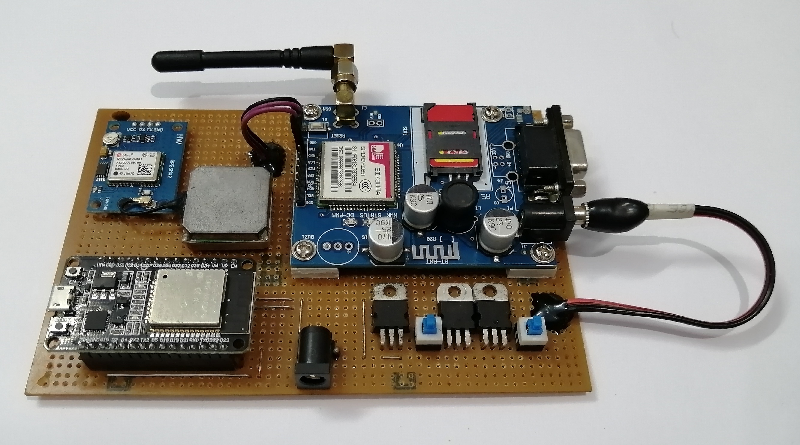
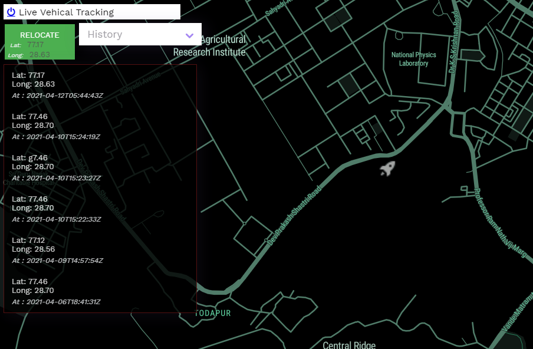

# Real Time Vehicle Tracking Device

Here is the <a href="https://abhyuday-bbd.000webhostapp.com/login_track.php" target="_blank"> live demo</a> of I made.
<br>
Login with : 
```
username : username
password : password
```


# Overview
It is an open source GPS tracking system. This project contains a C/C++ based Hardware support with a REST API backed database for storing location corrdinates and an Web Interface for Interaction. 

# Gallery
## Hardware



## App Interface


# Features
### Some of the features include
- Real-time GPS Tracking
- Time based location history
- Geofencing Functionality
- Account and device management


## 🚀 About Me
I'm an Enthusiastic Engineer

## 🔗 Links
[](https://github.com/rohitkrtiwari)

[](https://www.linkedin.com/in/rohitkrtiwari/)
